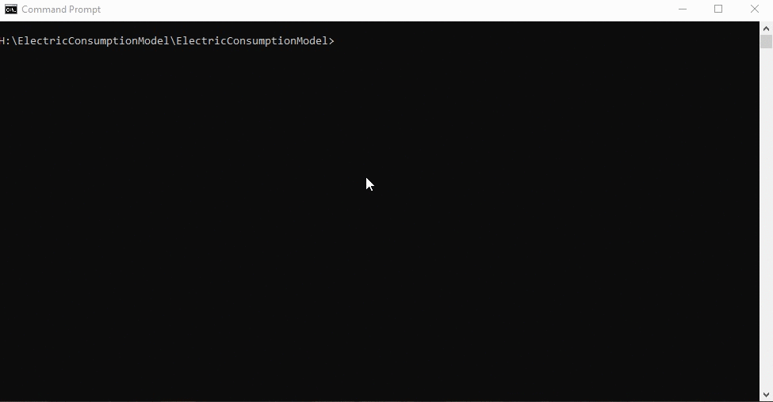

# XGBoost Electrical Consumption Prediction Model

This project contains a XGBoost model taking RECS Survey data and producing predicted electrical consumption. 
The model is built on windows platform. The model is trained using 2009 RECS Survey data: https://www.eia.gov/consumption/residential/data/2009/index.php?view=microdata.

## Getting Started

### Prerequisites

To install all the libraries needed to run this model, please run below command in the terminal.

```
pip install -r requirements.txt
```

To install XGBoost:

```
pip install xgboost-1.1.0-cp37-cp37m-win_amd64.whl
```

## Running the Model

To run the model from the terminal with an example test data file, navigate to the project path:

```
python model.py data/test.csv
```

The model will automatically run and return a predicted electrical consumption number based on the input.
Each test file (test.csv, test1.csv, test2.csv...) contains one row of data to input into the model. 
The actual consumption is at the last column of each test file; however, the last column is dropped when the data is passed into the model.
User can compare the actual consumption and the model generated value by looking at the last column named "KWH". 
The test file data are taken from the last 5 rows of 2009 RECS survey data, and the last 5 rows are not used for training the model.

### The model

The directory contains a pre-trained model based on the 2009 RECS Survey data. 
When the model is called from the above command, the pre-trained model will be loaded and compute the result.
The model training parameters are adjusted to give most accurate result. 

### Example


